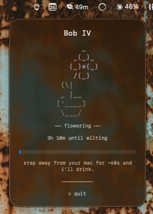

# Tend

A macOS menu-bar plant. Take breaks to keep it alive.

<p align="center">
  
</p>

Lives in your menu bar. The plant grows while you work and decays when you neglect it. The only way to feed it is to actually step away from your mac — sit still long enough and a button appears in the popover.

## Feeding tiers

Stay idle longer for a better reward. Each tier washes the plant's ASCII art in brighter colors that decay back over time.

| Idle    | Action    | Vibrancy peak | Decay back |
|---------|-----------|---------------|------------|
| 60s     | water     | gentle        | 1 min      |
| 3 min   | fertilize | richer        | 5 min      |
| 5 min   | feast     | full bloom    | 15 min     |

## Lifecycle

Seedling → Youngling → Growing → Flowering → Wilting → Dead. Growth advances on active time spent near the mac; decay is driven by time without a feed. Dead plants get a memorial screen, then you can plant a new one (the next ordinal in the family line — Bob, Bob II, Bob III, …).

## Build

```sh
./build.sh run       # build and launch
./build.sh install   # build and copy to /Applications
./build.sh reset     # quit + wipe local plant/lineage state
```

Requires macOS 13+.
